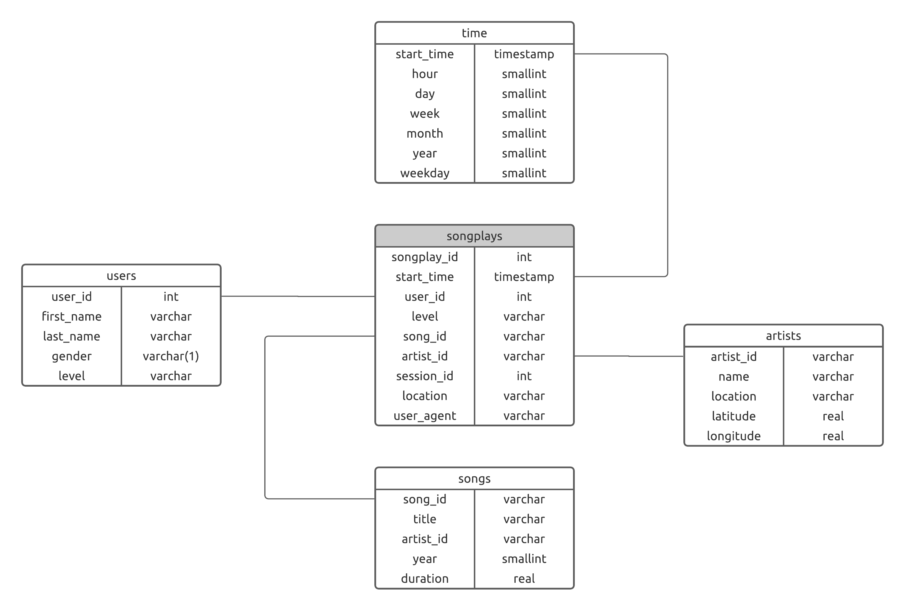
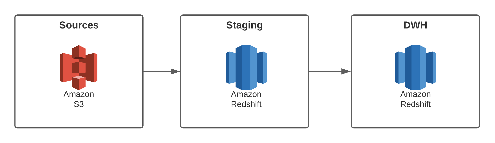

# Sparkify: Data Warehouse

This project is part of Udacity's **Data Engineering Nanodegree**. 

---

## Description

This project is an ETL pipeline using Python that helps a fake startup called Sparkify generate the databases required 
by its analytics team. As this team is particularly interested in understanding what songs users are listening to, the 
database was designed to allow simple queries and fast aggregations on song reproductions.

## Schema Design

Due to the analytical purposes of this database, the schema was designed to optimize reads and aggregations. More 
specifically, a [Star Schema](https://en.wikipedia.org/wiki/Star_schema) was utilized. 

The resulting schema was the following:



## ETL Pipeline



Raw data is as `json` files are located in AWS S3 buckets with the following endpoints:

* Song data: `s3://udacity-dend/song_data`
* Log data: `s3://udacity-dend/log_data`

The first step in the ETL process consists in ingesting at scale the `json` and stagin them into two different SQL tables 
in an AWS Redshift cluster. The staging tables have the following schema:


Once the data is staged in the Redshift cluster, the data warehouse tables are populated by querying the staging tables.
The staging tables assist in getting the source data into structures equivalent with the data warehouse FACT and 
DIMENSION destinations. 

## Setup

### Python

Python 3.9.4 is required to execute the scripts of this project. The library dependencies (of the whole workspace) have 
been extracted to the filed called `requirements.txt` and can be installed used the following command:

```
pip install -r requirements.txt
```

### Settings

To execute the code as-is, it is necessary to add a configuration file called `dwh.cfg` at the root directory of the
repository. The following fields should be added to experience full functionality:

```
[CLUSTER]
HOST=
DB_NAME=
DB_USER=
DB_PASSWORD=
DB_PORT=

[IAM_ROLE]
ARN=

[S3]
LOG_DATA=s3://udacity-dend/log_data
LOG_JSONPATH=s3://udacity-dend/log_json_path.json
SONG_DATA=s3://udacity-dend/song_data/A/A/C
```

### Execution

In order to create the databases clone this repo and once you have fullfilled the requirements detailed above run the following commands:

```
python create_tables.py
```

```
python etl.py
```

## Project Structure

```
├── img                                        <- Images used in README.md
├── dwh.cfg                                    <- Configuration file (needs to be added by the user!)
├── README.md                                  <- The top-level README for developers using this project.
├── create_tables.py                           <- Python script responsible for creating the schema and staging tables
├── etl.py                                     <- Python script responsible for ETL process
├── requirements.txt                           <- Library dependencies needed for the pipeline
├── sql_queries.py                             <- Contains all the SQL statments used by the pipeline
└── test.ipynb                                 <- Jupyter notebook used for testing purposes
```